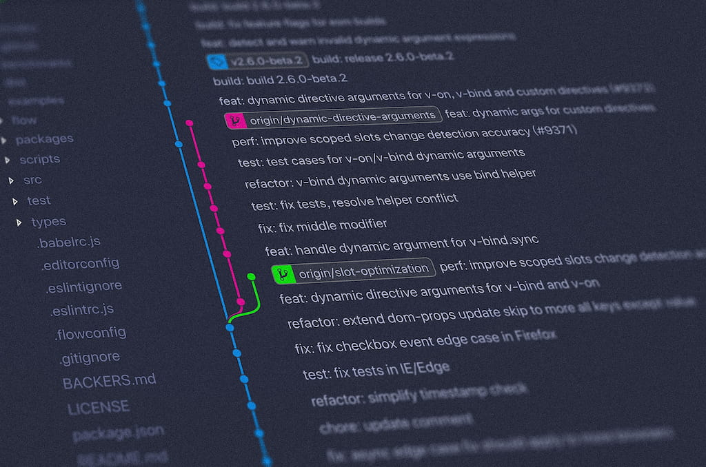

<div align="center">

</div>

<h1 align="center">Github Repository Template</h1>
<p align=center><i align="center">Template de Repositório do Github com arquivos essenciais e modelos customizáveis</i></p>

<br>

<div align="center">

<a href="https://www.markdownguide.org"></a>
<a href="https://docs.github.com/pt/actions"></a>
<br>
<a href=""></a>
<a href=""></a>
<a href=""></a>
<br>
<a href=""></a>
<a href=""></a>
<a href="https://github.com/dexdevlab/github-repo-template/blob/main/LICENSE"></a>

</div>

## Conteúdo

<br>

Este repositório tem como objetivo apresentar um template para criar facilmente a estrutura básica de qualquer repositório com o mínimo de documentação, organização e automação possíveis, respeitando as regras essenciais de linting e os critérios para manipular os dados de um repositório.
Além disso, contém referências para badges, arquivos de licença e modelos de README, bem como scripts de automação do GitHub Actions para facilitar o trabalho do desenvolvedor durante a publicação e organização das versões e releases.

## Instruções

<br>

### Utilizando o repositório como projeto para testar templates e scripts

1 - Faça um git clone ou o download do repositório, da forma que preferir

```bash
git clone https://github.com/dexdevlab/github-repo-template.git
```

### Testando os scripts do GitHub Actions

Você pode testar qualquer script contido no diretório ['GitHub Actions']('https://github.com/dexdevlab/github-repo-template/blob/main/templates/GitHub_Actions') colando o template
desejado em ['.github/workflows'](https://github.com/dexdevlab/github-repo-template/blob/main/.github/workflows) e poderá ver seu funcionamento no próximo commit que você aplicar no
seu repositório clonado.

### Configuração mandatória para executar os scripts

É obrigatório realizar este ajuste em qualquer repositório onde deseja que seu workflow funcione, para se certificar de que ele tenha as permissões necessárias para executar suas etapas.

Vá nas Configurações Gerais de Ações do repositório (`<https://github.com/><NOME_DO_USUARIO>/<NOME_DO_REPOSITORIO>/settings/actions`) e faça os seguintes ajustes:

1 - Marque 'Allow all actions and reusable workflows' em 'Actions permissions'

2 - Marque 'Read and write permissions' em 'Workflow permissions'

## Notas de versão

### v2.1.0-240427

- Alteração do template do README
- Atualização do README
- Novos badges: Chromatic e Storybook
- Alteração da categoria dos badges: Vercel, Netlify e Heroku
- Adição de novo script do Github Actions: Chromatic
- Alteração do nome da pasta dos scripts do Github Actions

### v2.0.0-240307

- Adição dos scripts do GitHub Actions e atualização de sintaxe dos mesmos
- Atualização da documentação
- Adição de scripts de limpeza do Yarn
- Adição de script de limpeza do Git para arquivos que continuam sendo monitorados mesmo depois de desmarcados
- Atualização do gitignore, que também pode ser usado como template
- Alteração do badge de versão e release
- Atualização no template de licenças e readme
- Alteração da sintaxe do script do GitHub Actions

### v1.2.1-230412

- Atualização da documentação

### v1.2.0-230412

- Alteração do estilo dos badges

### v1.1.0-230411

- Inclusão de espaço para thumbnail com centralização e ajustes de tamanho e proporção
- Atualização da documentação

### v1.0.4-230310

- Atualização da documentação

### v1.0.3-230309

- Atualização da documentação

### v1.0.2-230309

- Atualização da documentação

### v1.0.1-230309

- Ajuste no estilo de layout dos badges

### v1.0.0-230309

- Publicação do repositório.

## Autores

<br>

<a href="https://github.com/dexdevlab/github-repo-template/graphs/contributors">
  
</a>

## Contato

<br>

Se você gostou deste projeto, dê uma <a href="https://github.com/dexdevlab/github-repo-template" data-icon="octicon-star" aria-label="Star dexdevlab/github-repo-template on GitHub">estrela</a>. <br>
Para contato, envie um email a: <a href="mailto:dex.houshi@hotmail.com">dex.houshi@hotmail.com</a>

<hr>

<a name="section-licenca">

## Licença

</a>

Licenciado sob a [MIT License](https://github.com/dexdevlab/github-repo-template/blob/main/LICENSE).
